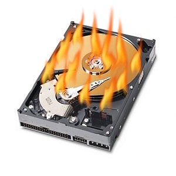

.. footer::

   10 ways to break your Ceph cluster - April 2018

10 ways to break your Ceph cluster
##################################

|
|

Who am I?
---------

   * Wido den Hollander (1986)
   * Owner and founder of 42on.com, Ceph Training and Consultancy Company
   * Co-owner and CTO @ PCextreme B.V. (Dutch hosting company)
   * Developed the Ceph (RBD) integration for libvirt storage drivers and Apache CloudStack
   * Wrote PHP and Java bindings for librados

42on.com:
---------
My company focused on Ceph, providing:

    * Consultancy
    * Training

|
|

Breaking your Ceph cluster
--------------------------
Through the past years I've seen many Ceph cluster go down.

Some of these clusters lost data :-(, but all due to human error.

I'll talk you through 10 actual cases I've seen where people brought down their Ceph cluster and some even lost data.

There is no chronological order for these cases, I've just picked 10.

1: Wrong CRUSH failure domain
-----------------------------
This Ceph cluster uses 3x replication and is spread out over 4 racks. *rack* was/is the intented failure domain.

On a weekend the power failed in one rack and the whole cluster stopped. Placement Groups became inactive.

I was called and logged in. After searching for a while I found CRUSH to be configured improperly.

Although the racks and hosts were properly mapped in the CRUSHMap this was not the case for the ruleset.

**Always** do a test on your cluster to verify failures are handled as intended.

The downtime was over 2 hours as it took some time to get the power restored to the rack.

The fix in this case was to change the CRUSH ruleset and wait for recovery to finish.

1: Wrong CRUSH failure domain
-----------------------------

::

    root default
        rack rack1
            host server1
            host server2
        rack rack1
            host server3
            host server4

::

    rule replicated_ruleset {
        ruleset 0
        type replicated
        step take default
        step chooseleaf firstn 0 host
        step emit
    }

2: Decommissioning a host
--------------------------
The cluster in this case was running with *2x* (size = 2, min_size = 1) replication and some hardware needed to be replaced.

The administrator decided that a node needed replacement and shut it down.

Recovery of Ceph kicked in after a few minutes and while I/O continued.

After a few hours a disk failed in one of the machines causing multiple PGs to go to the *incomplete* state.

This disk was the only copy left for various Placement Groups and by loosing that disk the data was *lost*.

After this happend I was called and ask to assist. We started the old machine and using PG recovery we were able to get a part of the data back.

The cluster was running CephFS and all *metadata* and *data* was affected. After a few days of debugging we were able to mount CephFS again in *Read-Only* state.

The result is that roughly 170TB of data on the CephFS cluster was (partially) affected.

The Ceph cluster had to be *abandoned* and rebuild from scratch.

3: Removing 'log' files in MON's data directory
-----------------------------------------------
If a cluster is in HEALTH_WARN state the data directory of the MONs started to grow as the Monitors keep a long(er) history of OSDMaps.

This caused the Monitors, all three, to run out of disk space and to stop working.

This administrator did a quick search on *sst files* and thought they were binary logs like how they work on a MySQL databases.

He removed the files and started the Monitors again, finding out they wouldn't start anymore due to corruption in their LevelDB database.

The result is that this cluster was *lost* as at that time (beginning of Hammer) there was no way to rebuild the Monitor database.

**Always** make sure Monitors have enough disk space and never manually remove files from their data directory!

4: Removing the wrong pool
--------------------------
The administrator of this Ceph cluster was confidend that the *rbd* pool of the cluster was not being used by anything.

He forgot to confirm of there was no data in the pool using *ceph df*, so he went ahead and removed the pool.

After he removed the pool he started to see issues on his iSCSI gateway. It turned out that there were active RBD images in that pool which were re-exported using iSCSI.

12TB of data was lost as there were no backups of these images.

**Always** set the *nodelete* flag on a pool and set the *mon_allow_pool_delete* setting to *false*! (Default in Luminous).

Although these settings might not have helped in this case these additional safeguards might prevent a admin from removing a pool by accident.

*Double*, no **triple** check before removing a pool! Always ask somebody else to take a look before removing a pool.

5: Setting the noout flag for a long time
------------------------------------------
Due to performance problems with scrubbing turned on the *noscrub* flag was set causing this cluster to be in HEALTH_WARN all the time.

During maintenance the *nout* flag was set and after completing the maintenance the flag was *not* removed.

Over the course of a few weeks disk 1, 2 and finally number 3 failed. Replication (size) was set to 3 for all pools, but *min_size* was set to 1.

I was called when Placement Groups became inactive to find out that 3 disks had failed and data was lost.

Eventually we were able to get back most of the data using some XFS filesystem recovery and reverting some PG history, but it could be that there is some silent data corruption throughout the cluster.

**Always** aim for a cluster running HEALTH_OK and take a look at the cluster if it's in HEALTH_WANR for a longer period.

In addition, make sure that min_size is set to *>1*. It's a safety measure for your data.

6: Mounting XFS with nobarrier option
-------------------------------------
For performance reasons this SSD-only cluster was mounted with *nobarrier*.

::

    /dev/sdh on /var/lib/ceph/osd/ceph-181 type xfs (rw,nobarrier)

Write barriers are there for a good reason:

    A write barrier is a kernel mechanism used to ensure that file system metadata is correctly written and ordered on persistent storage, even when storage devices with volatile write caches lose power.

Although all servers were equipped with redundant power supplies a *ground failure* caused a power outage on circuit A *and* B in the datacenter.

This power outage resulted in all OSD hosts to go down at the same time and that lead to many corrupted XFS filesystems and OSD data stores.

We were not able to recover this Ceph cluster. Roughly 100TB of data was lost.

**Never** mount your XFS filesystem with nobarrier!

7: Enabling Writeback on HBA without BBU
----------------------------------------
This case is similar to the previous one. Instead of disabling *write barriers* in Linux the cache mode of the HBA was set to *Writeback* without a *Battery Backup Unit* present.

A power outage caused some machines to go down resulting in corrupted XFS filesystems and OSD data stores on those hosts.

Luckily this happend in *one* failure domain (rack) of the Ceph cluster and no data was lost.

**However**, never turn on Writeback caching in your HBA without a Battery Backup Unit present. It's just dangerous!

8: Creating too many Placement Groups
-------------------------------------
I assisted this customer with building their Ceph cluster for running behind OpenStack.

The size of the cluster resulted in the *volumes* having 8192 Placement Groups.

As time progressed they created multiple pools on the cluster without consulting me. In total 10 additional pools, all with *8192* Placement Groups. (~70k extra PGs)

A few months later a power outage caused the whole cluster to restart.

The OSD hosts were lacking CPU and Memory to work their way through peering and recovery of so many Placement Groups. Causing a flapping OSD situation.

I wasn't called until the day after it happend which resulted in over 24 hours of flapping OSDs and *thousands* of new OSDMaps.

Eventually we recovered the cluster after babysitting it for 5 days and adding additional Memory and CPUs to the cluster.

**Be cautious** when creating Placement Groups. It can hurt you when the cluster needs to re-peer *all* Placement Groups!

9: Using 2x replication
-----------------------
Not tied to one specified situation, but I've just seen too many cases where data was either corrupted or lost by clusters running with 2x replication.

A *single* disk failure in 2x replication can already lead to loss or corruption of data.

Imagine a host taken down for maintenance. A portion of the data now relies on one disk. If this disk fails all the data is lost.

I've seen these cases just happen too many times! Do **not** consider using 2x replication if you value your data!

10: Underestimating Monitors
----------------------------
Monitors are often underestimated badly by a lot of people. The word *monitor* might confuse them and think that these daemons only serve a *monitoring* purpose like Zabbix or Nagios.

This results to running them on unreliable and cheap hardware causing all kinds of problems.

I've seen people run them on SD-Cards in Dell servers and then wearing through the SD-Card quickly due to the Monitor writes to the LevelDB/RocksDB database.

Use **reliable** hardware for your Monitors! Yes, they are pretty lightweight daemons and usually don't consume many resources. But they are a *vital* part of your Ceph cluster.

I always recommend *dedicated* hardware for Monitors and using *datacenter grade* / *write intensive* SSDs for their data stores.

A 200GB SSD is vastly more then the Monitor will use, but you never want your Monitor to run out of diskspace and potentially face data corruption.

11: Updating Cephx keys with the wrong permissions
----------------------------------------------
All good things go to eleven, right?

In this case a admin updated the cephx key for a OpenStack deployment and he made a typo in the permissions.

By accident he revoked the **w** (write) permission for that user on the pool **volumes**.

This caused Ceph (librados) to start returning errors to librbd which issued these errors to the Virtual Machines.

A single typo caused over 2.000 Instances to go down with filesystems in Read-Only mode.

.. code:: bash

    caps osd = "allow rx pool=volumes, allow rwx pool=volumes-ssd"

Thank you!
----------
Thanks for listening!

Questions?

|

Find me:
    * E-Mail: wido@42on.com
    * Company: https://42on.com/
    * Blog: https://widodh.nl/
    * Github: https://github.com/wido
    * Twitter: @widodh
    * Presentations: https://github.com/wido/presentations
