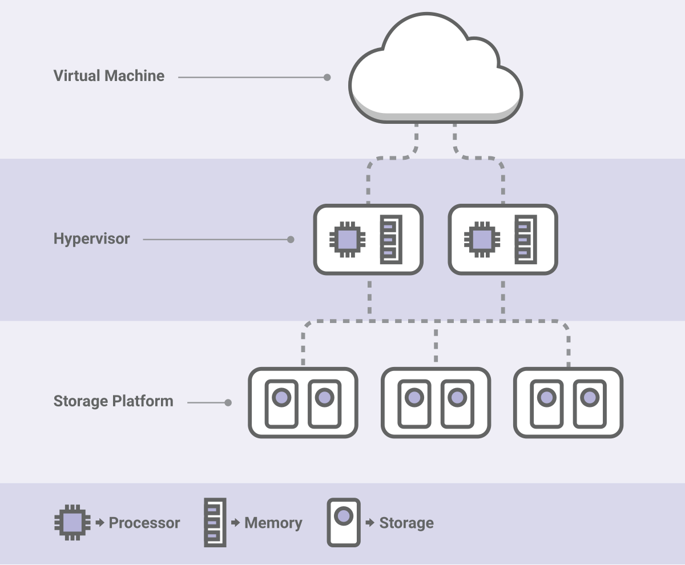
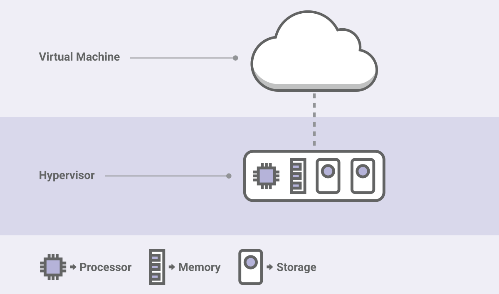
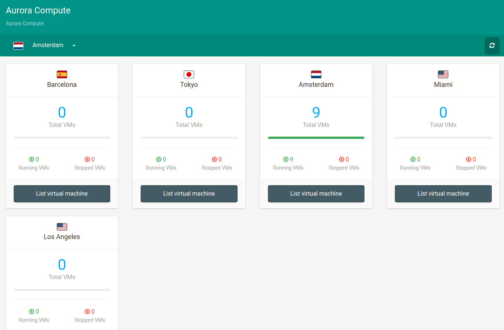
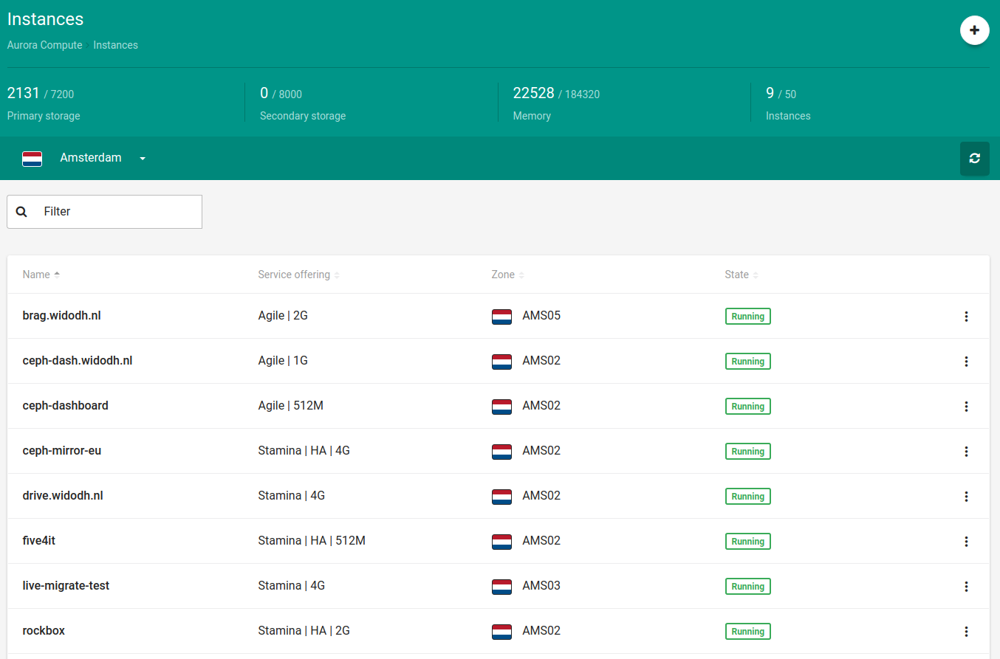
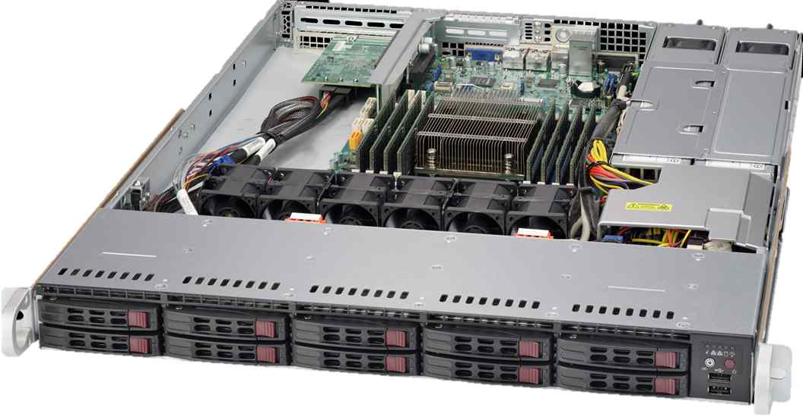
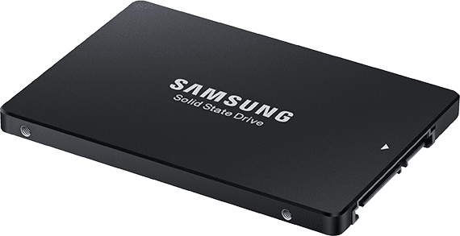
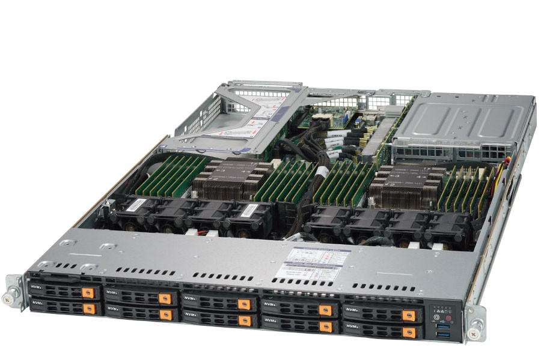

.. footer::

   Building a highly available cloud with Ceph and Apache CloudStack

Building a highly available cloud with Ceph and Apache CloudStack
#################################################################

|
|

.. image:: ../../common/images/ceph/ceph-standard-800.png
   :align: center
   :width: 1200

Who am I?
---------

   * Wido den Hollander (1986)
   * Owner and founder of 42on.com, Ceph Training and Consultancy Company
   * Co-owner and CTO @ PCextreme B.V. (Dutch hosting company)
   * Developed the Ceph (RBD) integration for libvirt storage drivers and Apache CloudStack
   * Wrote PHP and Java bindings for librados
   * Ceph Board member
   * Apache CloudStack PMC member

Ceph
----
Being technical and owning a hosting company you quickly get frustrated with storage. It is expensive, difficult and just annoying. Storage is just always the problem.

While searching the internet I found this little project called *Ceph* still being hosted in http://ceph.newdream.net/ and there was this guy Sage publishing some tarballs.

At that time, late 2009, there was version 0.18 and I gave it a try. It worked!

Ever since I've been involved with the project. I write code, patches, documentation and I am a member of the board.

Apache CloudStack
-----------------
From my role as CTO at PCextreme I first came into contact with CloudStack shortly after Citrix bought cloud.com in 2012.

I travelled to the Citrix office in California for their first cloud.com/CloudStack conference at which they announced donation to the Apache Foundation.

Ever since I've been working with CloudStack as a committer and PMC member. It is a vital part of my company.

|

.. image:: ../../common/images/cloudstack/acslogo.png
    :align: center
    :width: 900

PCextreme
---------
Started the company when I was 16 from home. It has now grown to a company with 30 employees and runs thousands of servers.

Dutch hosting company focused on:

    * Traditional webhosting
    * Cloud computing

|
|

.. image:: ../../common/images/logo-pcx-1000x200_whitebg.png
    :align: center
    :width: 400

Ceph and CloudStack
-------------------
At PCextreme we offer our cloud services under the name *Aurora*.

We offer various products under this umbrella:

    * Compute (Virtual Machines)
    * DNS (Intelligent DNS service)
    * Objects (Amazon S3 compatible service)

All services are available over both IPv4 and *IPv6*.

Aurora Compute
--------------
We offer our *Compute* service in two different flavors:

    * Stamina
    * Agile

Both are managed by Apache CloudStack (KVM hypervisor), but only Stamina uses Ceph.

Our services are offered from different locations in the world:

    * Amsterdam (main location with 3 datacenters)
    * Barcelona
    * Miami
    * Tokyo
    * Los Angeles
    * Antwerp (Soon)
    * Frankfurt (Soonish)

Compute: Stamina
----------------
Virtual Machines running on *Stamina* run in High Available mode by using Ceph with 3x data replication for its storage.

Should a Hypervisor fail CloudStack will start the VM on a different hypervisor.

In case of a failure of a Ceph node (or disk) the high availability of Ceph makes sure all data stay available and is safely stored.

Compute: Stamina
----------------

|

Compute: Agile
--------------
*Agile* Virtual Machines are deployed on hypervisors with *local* SSD storage (Samsung PM863a SATA and Samsung PM963 NVMe) and are *not* Highly Available.

There is no RAID nor any form of data replication for this Virtual Machines.

This offering is for customers who build their application cloud aware and can loose a Virtual Machine.

Compute: Agile
--------------

|

Apache CloudStack
-----------------
For those not familiar with CloudStack and its terminology a quick introduction:

CloudStack uses a concept of a *Management server* (or a cluster of them) which manages a Agent running on a KVM, Xen, VMWare of Hyper-V hypervisor.

These Agents manage *Primary Storage* (virtual disks) and *Secondary Storage* (templates and snapshots).

In addition there are *Console Proxy*, *Secondary Storage* and *Virtual Router* Virtual Machines which are all under control of the Management Server(s).

Ceph and CloudStack
-------------------
When we first (Early 2013) started using CloudStack there was no integration between CloudStack and Ceph's block device RBD.

I wrote the integration in libvirt and the Java bindings in order to support Ceph storage for KVM in CloudStack.

Let's say that the road to our current sitation was a interesting one, we learned a few lessons:

    * Do not use HDDs behind VMs. Customers will always complain about performance.
    * Apply I/O limitations to all customers. A small group of customers will eat all IOps.
    * KISS! Overcomplicating things resulted in hickups because we tried to make it to fancy.
    * Failure domains! Yes, large environments are financially very attractive, but they will go down at some point and all customers start calling.

HDDs vs SSDs in the cloud
-------------------------
At first we focused on a low price per GB as we thought that would attract customers. And it did.

We soon learned that customers expect unlimited IOps with the Gigabytes they are provided.

HDDs are slow, very, very slow compared to SSDs. Although SSDs are more expensive per GB they are very cheap for the IOps they provide.

The latter is actually the most important one we found out.

Even if you use SSDs for storage you still need to apply I/O limitations to all virtual disks provided to Virtual Machines.

Customers will use all the IOps they can get. People will run very I/O intensive applications like databases on their Virtual Machines.

For every GB a customer buys we allocate X amount of IOps to that disk. CloudStack supports I/O limitations on virtual dsks and are enforced by libvirt/KVM.

Failure domains
---------------
Both Ceph and CloudStack scale to very large sizes. Ceph is able to managed thousands of disks, PetaBytes of storage and even more.

CloudStack can handle hundreds of hypervisors and tens of thousands Virtual Machines.

What we however learned the hard way is that things will fail at some point. Human failure, software bugs, a combination of them or just bad luck. Murhpy will come along at some point.

We now build moderately sized cloud environments which we glue together in our Control Panel. The customer is not aware of this abstraction as our Control Panel talks to different CloudStack Management servers.

Control Panel
-------------

|

Control Panel
-------------

|

Our current design
------------------
With the lessons learned with running with Ceph and CloudStack for over 5 years now we have come up with a design which works really well for us.

CloudStack Hypervisors (8 to 12 per cluster):

    * Dual Intel Xeon CPU
    * 256 ~ 512GB of Memory per node
    * Redundant 10Gbit connection

|

Ceph cluster:

    * 3 Monitors
    * 15 to 25 1U nodes with 10 SSDs each
    * Redundant 10Gbit connection

Our current design
------------------
SuperMicro SYS-1018R-WC0R

    * Intel Xeon E5-1650 v3 3.50Ghz 6-core
    * 64GB Memory
    * 64GB SATA-DOM (Operating System)
    * 10x Samsung PM863a 1.92TB (SATA)

Our current design
------------------
All hardware (SuperMicro) is installed in a single rack with two 10Gbit (Arista) Top-of-Rack switches which also handle the gateways (IPv4 and IPv6).

This allows us to run thousands of Virtual Machines in a single 19" rack with a redundant 32A/7kW power supply.

Scaling larger is technically possible, but by confining things to smaller *islands* we are able to spread risks and reduce the load on our staff in case of a outage.

SSDs
----
Our Ceph clusters all run on Samsung PM-series SSDs. Most of our clusters run on SATA with the PM863a SSDs, but we recently ordered our first batch of hardware with the PM963 NVMe SSDs.

The hardware has been installed, but we were not able to run any tests on them. We do expect a rather large performance improvement going from SATA to NVMe.

Overall the PM-series have performed very, very well for us. Failure rates is <1% and we haven't seen any of them wear out while they are being used heavily in a 24/7 application.

As we are very satisfied with the performance and price the Samsung PM-series provide we have not looked at other vendors.

|

Our new design
--------------

SuperMicro SYS-1029U-TN10RT

    * Dual Intel Xeon Silver 4110 Processor 8-core 2.10GHz
    * 96GB Memory
    * 128GB SATA-DOM (Operating System)
    * 10x Samsung PM963 1.92TB (NVMe)

Software
--------
Our complete infrastructure runs on Ubuntu LTS versions:

    * Ubuntu 14.04
    * Ubuntu 16.04

|

CloudStack and Ceph:

    * CloudStack 4.9 and 4.10
    * Ceph 12.2.X Luminous Release with BlueStore

Ceph BlueStore
--------------
Traditionally Ceph stored all data eventually on a XFS filesystem running underneath the OSD. This backend is called *FileStore* This had some serious performance implications as well as some scaling problems.

With the release of Ceph Luminous (12.2.X) a new storage backend *BlueStore* was introduced, which provides:

    * More performance by consuming a RAW Block Device
    * CRC checking on all data
    * Compression

In the last few weeks we migrated all our data (~3PB) from FileStore to BlueStore without *any* downtime. We re-installed all machines from Ubuntu 14.04 to 16.04 and at the same time wiped all OSDs running with FileStore and migrated them to BlueStore.

Looking at statistics we see a latency improvement (lower IO-wait) inside Virtual Machines of about 20% overall.

IPv6
----
All our services are IPv6-ready and enabled. This means that each Virtual Machine deployed on our infrastructure obtains both a IPv4 and IPv6 address.

Interesting fact is that internally Ceph and CloudStack are IPv6-only. Our hypervisors and Ceph nodes only have a IPv6 address over which they are managed and controlled.

|

.. image:: ../../common/images/ipv6.jpg
    :align: center
    :width: 400

Conclusion
----------
We manage tens of thousands of Virtual Machines running with Ceph and CloudStack and we think it is a winning and golden combination:

    * Open Source
    * Easy to access projects
    * Easy to deploy and maintain
    * Stable and fast

Thank you!
----------

Thanks for listening, questions?

Contact me:

    * Github: wido
    * Twitter: @widodh
    * LinkedIn: widodh
    * E-Mail: wido@pcextreme.nl
