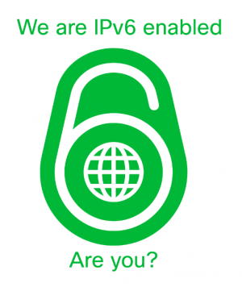

.. footer::

   IPv6 in production with Apache CloudStack - August 2017

IPv6 in production with Apache CloudStack
##########################################

|
|

.. image:: ../../common/images/cloudstack/acslogo.png
   :align: center
   :width: 1200

Who am I?
---------

    * Wido den Hollander (1986)
    * Co-owner and CTO @ PCextreme B.V. (Dutch hosting company)
    * CloudStack VP
    * Developed the Ceph (RBD) integration for libvirt and CloudStack
    * Work on the KVM Hypervisor code
    * Developed the IPv6 integration for Basic Networking

Who is PCextreme B.V.?
----------------------

    * Dutch hosting company founded in 2004
    * 30 employees
    * 50.000 customers
    * > 100.000 shared hosting packages
    * Running a public cloud on Apache CloudStack with IPv6 and Ceph storage
    * CloudStack zones in Amsterdam, Barcelona, Miami, Tokyo and Los Angeles

Hello IPv6!
-----------

|
|

Did you dare to touch it yet?

|
|

Hello IPv6!
------------

|

Hello IPv6!
-----------

|
|

We've been running IPv6 in production since 2011! :-)

|

IPv6
----

::

    if (ipv4addresses.length < 5%) {
        System.out.println("IPv4 is almost exhausted");
    }

|

We are almost out of available IPv4 space, no, seriously. Yes, companies still have
addresses to spare, but obtaining *new* addresses is almost impossible.

IPv4 is 32-bits long which means we have *4,294,967,296* IPv4 addresses.

IPv6 is 128-bits. That's not 4x the amount of addresses, but:

**340,282,366,920,938,463,463,374,607,431,768,211,456**!

No more NAT
-----------
With IPv6 each host on the Internet will get a publicly routed address

This means that there is no more need for NAT

Routers will become true routers again instead of *packet translators*.

Aurora Compute
--------------
We call our cloud offering products *Aurora*. Our Virtual Machine offering is called *Compute*.

It's offered in two flavors:

    * Agile: Instances with Local SSD storage (No HA)
    * Stamina: Redundant storage powered by SSD-only Ceph clusters

|

We use the *KVM* hypervisor running under Ubuntu Linux.

Basic Networking
----------------
All Instances are directly connected to your gateway. The Virtual Router is only used
for DHCP and Metadata.

Routing in our case is handled by Arista and Juniper routers.

IPv6 in Basic Networking
------------------------
With the release of CloudStack *4.10* IPv6 is fully supported in Basic Networking.

We've been running a hacked version of 4.9 for a while with these enhancements backported to them.

This allows us to provide Instances both IPv4 and IPv6 connectivity.

Stateless Address AutoConfiguration
-----------------------------------
"Stateless Auto Configuration is an important feature offered by the IPv6 protocol. It allows the various devices attached to an IPv6 network to connect to the Internet using the Stateless Auto Configuration without requiring any intermediate IP support in the form of a Dynamic Host Configuration Protocol (DHCP) server."

With IPv6 there is usually no DHCP server handing out IP-addresses to clients.
Routers 'broadcast' network options like the subnet on the network and using that
information clients can generate their own *stable* IPv6 address using their unique MAC-address.

This technique is used in *Basic Networking* to hand out addresses to Instances.

The Management server can calculate based on this information which address the Instance will obtain.

Control Panel
-------------
Our custom-made control panel allows our customers to easily deploy and maintain their Instances
running in our different zones over the world.

IPv4 and IPv6
-------------

When looking at the Instance details a customer will see both the IPv4 and IPv6 address of the Instance.

Inside the Instance
-------------------
when looking at the network configuration inside the Instance you will see both a IPv4 and IPv6 address.

::

    2: eth0: <BROADCAST,MULTICAST,UP,LOWER_UP> mtu 1500
    link/ether 06:8c:ba:00:04:77 brd ff:ff:ff:ff:ff:ff
    inet 185.27.175.43/23 brd 185.27.175.255 scope global eth0
       valid_lft forever preferred_lft forever
    inet6 2a00:f10:121:400:48c:baff:fe00:477/64 scope global dynamic 
       valid_lft 2591961sec preferred_lft 604761sec
    inet6 fe80::48c:baff:fe00:477/64 scope link 
       valid_lft forever preferred_lft forever

POD addressing
--------------
Each POD gets a */64* subnet in our case. That means we have 64-bits available for addressing in that POD. (1.8446744e+19 addresses)

In practice the amount of IPv6 addresses is therefor never a problem in a POD.

With IPv4 we always have to find a balance between the amount of *public* IPv4 IPs we assign to a POD and the hardware resources to support it with.

IPv6-Only Instances
-------------------
We are now also working on providing IPv6-only VMs. These VMs will still have a IPv4 address, but they will obtain a RFC1918 address which is behind NAT on our routers.

Incoming connectivity to the Instance can only be done using the public IPv6 address of that Instance.

We see a lot of customers running clusters where their MySQL, Redis, ElasticSearch or other tools no longer require IPv4. Only their webservers or loadbalancers still require IPv4.

Using RFC1918 addresses for IPv4 in PODs we can allocate more then enough addresses in a POD to better utilize our hardware resources.

We will launch these Instances later this year starting in our Amsterdam zones.

Security Grouping
-----------------
Ingress and Egress Security Grouping support both IPv4 (*0.0.0.0/0*) and IPv6 (*::/0*) rules.

|

Challenges
----------
Did we face many challenges when deploying IPv6? Yes!

    * Bugs in our routers
    * Training our staff
    * Implementing IPv6 in CloudStack's Basic Networking
    * Teaching our customers

Contact Me
----------

    * https://blog.widodh.nl/
    * wido@widodh.nl
    * @widodh

|

Thanks for listening!