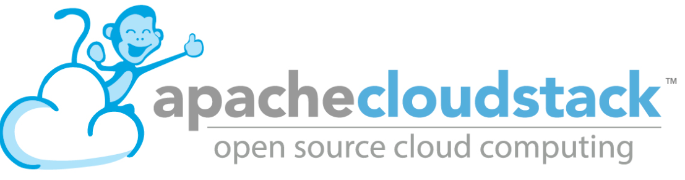

.. footer::

   IPv6 in production with Apache CloudStack - August 2017

IPv6 in production with Apache CloudStack
##########################################

|
|

Who am I?
---------

    * Wido den Hollander (1986)
    * Co-owner and CTO @ PCextreme B.V. (Dutch hosting company)
    * CloudStack VP
    * Developed the Ceph (RBD) integration for libvirt and CloudStack
    * Work on the KVM Hypervisor code
    * Developed the IPv6 integration for Basic Networking

Who is PCextreme B.V.?
----------------------

    * Dutch hosting company founded in 2004
    * 30 employees
    * 50.000 customers
    * > 100.000 shared hosting packages
    * Running a public cloud on Apache CloudStack with IPv6 and Ceph storage
    * CloudStack zones in Amsterdam, Barcelona, Miami, Tokyo and Los Angeles

Hello IPv6!
-----------

|
|

Did you dare to touch it yet?

|
|

Hello IPv6!
-----------

|
|

We've been running IPv6 in production since 2011! :-)

IPv6
----

::

    if (ipv4addresses.length < 5%) {
        System.out.println("IPv4 is almost exhausted");
    }

|

We are almost out of available IPv4 space, no, seriously. Yes, companies still have
addresses to spare, but obtaining *new* addresses is almost impossible.

No more NAT
-----------
With IPv6 each host on the Internet will get a publicly routed address

This means that there is no more need for NAT

Routers will become true routers again instead of *packet translators*.

Basic Networking
----------------
All Instances are directly connected to your gateway. The Virtual Router is only used
for DHCP and Metadata.

Routing in our case is handled by Arista and Juniper routers.

IPv6 in Basic Networking
------------------------
With the release of CloudStack *4.10* IPv6 is fully supported in Basic Networking.

We've been running a hacked version of 4.9 for a while with these enhancements backported to them.

This allows us to provide Instances both IPv4 and IPv6 connectivity.

*All* Instances have both IPv4 *and* IPv6 connectivity.

Control Panel
-------------
Our custom-made control panel allows our customers to easily deploy and maintain their Instances
running in our different zones over the world. This product is called *Aurora Compute*.

.. image:: ./cp_pcextreme_overview.png
    :align: center

Agile vs Stamina
----------------
We have two kinds of 'Service Offerings' for our customers:

    * Agile: These Instances run on Local SSD storage without any form of replication of backup
    * Stamina: Data of these Instances is stored on a SSD-only Ceph cluster using 3x replication

|

Both are priced differently and customers can choose which one suits their needs.

IPv4 and IPv6
-------------

When looking at the Instance details a customer will see both the IPv4 and IPv6 address of the Instance.

|

.. image:: ./cp_ip4_ipv6.png
    :align: center

Security Grouping
-----------------